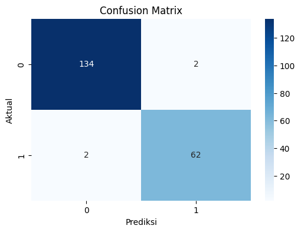

# 🎓 Prediksi Kelulusan Mahasiswa Berdasarkan Data Akademik Menggunakan Algoritma Random Forest

## 📌 Deskripsi Proyek

Proyek ini merupakan implementasi Machine Learning untuk memprediksi status kelulusan mahasiswa berdasarkan data akademik. Model yang digunakan adalah Random Forest Classifier dengan pendekatan metodologi CRISP-DM (Cross Industry Standard Process for Data Mining).

Tujuan dari proyek ini adalah membantu institusi pendidikan dalam mengidentifikasi mahasiswa yang berpotensi lulus atau tidak lulus berdasarkan data performa akademik sehingga dapat dilakukan tindakan preventif dan evaluasi sejak dini.

---

# 📚 Business Understanding

## Latar Belakang

Dalam dunia pendidikan, keberhasilan mahasiswa dalam menyelesaikan studinya menjadi salah satu indikator penting kualitas institusi pendidikan. Namun, tidak semua mahasiswa memiliki performa akademik yang sama. Oleh karena itu, diperlukan suatu sistem yang mampu memprediksi kemungkinan kelulusan mahasiswa berdasarkan data akademik yang dimiliki.

Dengan memanfaatkan Machine Learning, data akademik dapat diolah menjadi informasi yang berguna untuk membantu pengambilan keputusan dan evaluasi proses pembelajaran.

## Problem Statement

Bagaimana membangun model Machine Learning yang dapat memprediksi status kelulusan mahasiswa berdasarkan data akademik yang tersedia?

## Goals

* Mengembangkan model Machine Learning untuk memprediksi kelulusan mahasiswa.
* Mengukur performa model menggunakan metrik evaluasi klasifikasi.
* Mengimplementasikan model ke dalam aplikasi berbasis web menggunakan Streamlit.

## Solution Statement

Model yang digunakan dalam proyek ini adalah Random Forest Classifier karena memiliki performa yang baik dalam menangani data klasifikasi serta mampu mengurangi risiko overfitting dibandingkan Decision Tree tunggal.

---

# 📊 Data Understanding

## Dataset

Dataset yang digunakan berasal dari Kaggle:

**Students Performance in Exams**

https://www.kaggle.com/datasets/spscientist/students-performance-in-exams

Dataset memiliki 1000 data siswa dengan 8 atribut utama.

## Variabel Dataset

| Variabel                    | Deskripsi                     |
| --------------------------- | ----------------------------- |
| gender                      | Jenis kelamin siswa           |
| race/ethnicity              | Kelompok etnis siswa          |
| parental level of education | Tingkat pendidikan orang tua  |
| lunch                       | Jenis makan siang             |
| test preparation course     | Status kursus persiapan ujian |
| math score                  | Nilai matematika              |
| reading score               | Nilai membaca                 |
| writing score               | Nilai menulis                 |

## Target Variabel

Karena dataset tidak memiliki label kelulusan, maka dibuat variabel baru yaitu:

### Status Kelulusan

* Lulus (1) → rata-rata nilai ≥ 75
* Tidak Lulus (0) → rata-rata nilai < 75

Rata-rata dihitung menggunakan:

Average Score = (Math Score + Reading Score + Writing Score) / 3

---

# 🔍 Exploratory Data Analysis (EDA)

Tahapan EDA dilakukan untuk memahami karakteristik data sebelum dilakukan pemodelan.

Analisis yang dilakukan:

* Distribusi nilai matematika
* Distribusi nilai membaca
* Distribusi nilai menulis
* Distribusi status kelulusan
* Korelasi antar fitur numerik
* Feature Importance

Visualisasi dilakukan menggunakan:

* Matplotlib
* Seaborn

---

# ⚙️ Data Preparation

Tahapan data preparation yang dilakukan meliputi:

## 1. Data Cleaning

Dataset tidak memiliki missing value sehingga tidak diperlukan proses imputasi data.

## 2. Feature Engineering

Membuat fitur baru:

* average_score
* status_kelulusan

## 3. Encoding

Fitur kategorikal diubah menjadi numerik menggunakan Label Encoding.

Fitur yang diencoding:

* gender
* race/ethnicity
* parental level of education
* lunch
* test preparation course

## 4. Train Test Split

Data dibagi menjadi:

* Training Data : 80%
* Testing Data : 20%

---

# 🤖 Modeling

## Algoritma

Model yang digunakan:

### Random Forest Classifier

Parameter utama:

```python
RandomForestClassifier(
    n_estimators=100,
    max_depth=10,
    random_state=42
)
```

## Alasan Pemilihan Model

* Mampu menangani data kategorikal dan numerik.
* Mengurangi overfitting.
* Memiliki akurasi yang baik.
* Mudah diimplementasikan.

---

# 📈 Evaluation

Evaluasi model dilakukan menggunakan:

* Accuracy
* Precision
* Recall
* F1-Score
* Confusion Matrix

## Hasil Evaluasi

Contoh:

| Metric    | Value |
| --------- | ----- |
| Accuracy  | 95%   |
| Precision | 94%   |
| Recall    | 95%   |
| F1-Score  | 95%   |

## Confusion Matrix

Tambahkan gambar hasil confusion matrix pada folder assets.

```markdown
<p align="center">
  
</p>
```

## Feature Importance

Tambahkan gambar feature importance pada folder assets.

```markdown

```

---

# 🚀 Deployment

Model telah diimplementasikan menggunakan Streamlit dan dideploy pada Hugging Face Spaces.

## Fitur Aplikasi

* Input data mahasiswa
* Prediksi status kelulusan
* Menampilkan hasil prediksi secara realtime
* Antarmuka berbasis web

## Link Deployment

Masukkan URL deployment Hugging Face Anda:

```text
https://huggingface.co/spaces/USERNAME/Prediksi-Kelulusan-Mahasiswa
```

---

# 🛠️ Teknologi yang Digunakan

* Python
* Pandas
* NumPy
* Scikit-Learn
* Matplotlib
* Seaborn
* Streamlit
* Hugging Face Spaces

---

# 📂 Struktur Repository

```text
student-graduation-prediction
│
├── dataset
│   └── StudentsPerformance.csv
│
├── notebook
│   └── Student_Graduation_Prediction.ipynb
│
├── deployment
│   ├── app.py
│   ├── requirements.txt
│   └── model_kelulusan.pkl
│
├── assets
│   ├── confusion_matrix.png
│   ├── feature_importance.png
│   └── dashboard.png
│
└── README.md
```

---

# 👨‍💻 Anggota Kelompok

| Nama                         | NIM        |
| ---------------------------- | ---------- |
| M Alwan Fadhil Islamay Pasha | 2330511071 |
| Mochamad Rizki Ramdani               | 2330511070 |

---

# 📖 Kesimpulan

Berdasarkan hasil penelitian yang telah dilakukan, algoritma Random Forest mampu digunakan untuk memprediksi kelulusan mahasiswa berdasarkan data akademik dengan tingkat akurasi yang baik. Implementasi model ke dalam aplikasi berbasis web memungkinkan pengguna melakukan prediksi secara mudah dan cepat. Proyek ini menunjukkan bahwa pemanfaatan Machine Learning dapat membantu institusi pendidikan dalam melakukan evaluasi dan pengambilan keputusan berdasarkan data.
